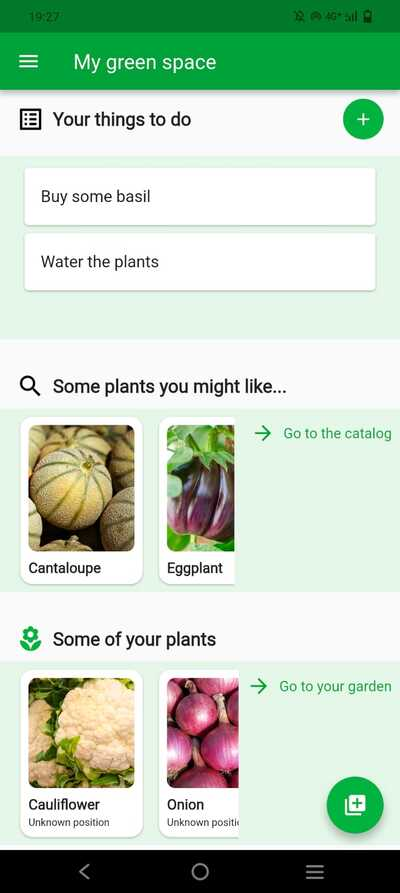
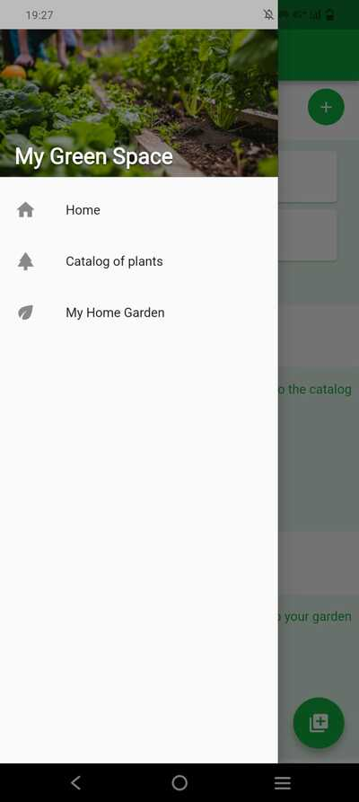
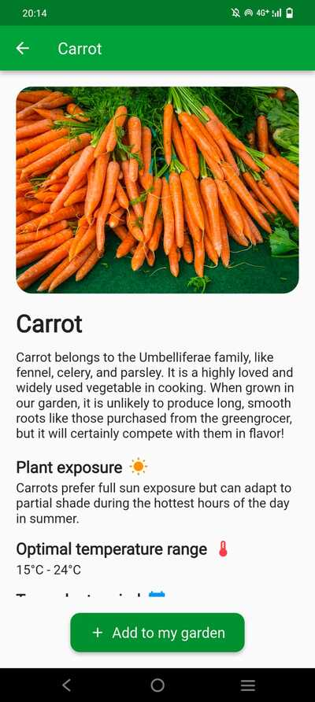

# PDMIU Project  
## My Green Space  

**Student**: Francesco Pio Rossi  
**Student ID**: 331825  
**Professor**: Cuno Lorenz Klopfenstein  
**Exam Session**: June 2025  

## Application Overview  

**My Green Space** is a Flutter application designed to help users manage their personal home gardens. The app features a plant catalog where users can browse a limited selection of plants and view key information such as a short description, optimal temperature, transplanting period, and more.  

Users can create instances from this catalog to represent their own personal plants. Each personal plant is assigned a unique ID, and users can store specific information for each one — such as its location, a list of irrigation records, personal notes, and photos documenting the plant's growth over time. Additionally, users can maintain a to-do list related to garden care and maintenance.  

## Some Technical Details  

The app uses the **Riverpod** library for state management. User data is stored in **Supabase**, an online relational database. Supabase's storage feature is also used to save user-uploaded plant photos. 

For managing the local state — specifically the to-do list — the **shared_preferences** package is utilized.  

 ## Homepage and Navigation Between Different Pages
 
The homepage displays a preview of some random plants from the catalog as well as a selection of plants from the user’s personal garden. By tapping on a specific plant card, the user can navigate to the detailed page of that plant—either from the garden or the catalog. Additionally, the homepage shows the user's to-do list, which is stored locally using the `shared_preferences` package.



The drawer allows the user to navigate to the plant catalog page or to the personal plants page. Before navigating to a specific page through the drawer, the navigation stack is cleared, preventing the user from going back to the previous page.



## Management of Catalog Plants
The catalog page displays the full list of plants available in the app, from which the user can create instances representing the plants in their personal garden.


By tapping on a card, the user is taken to a detailed page with more information about the selected plant.



Each plant in the catalog is associated with a set of tags. The user can filter the plant list by selecting a subset of tags: only the plants that contain **all** the selected tags will be shown. 

When the user wants to create an instance of a plant to represent one in its garden, he can set various details such as the planting date, the position, and a list of notes. He can also change the image associated with the plant.


In this application, state management is entirely handled using Riverpod. For example, the data related to the catalog plants is managed through the following providers:

- **plantCatalogProvider**: provides a list of `Plant` objects. The data is loaded from a JSON file.
- **allTagsProvider**: provides a list of strings representing all available tags.
- **selectedTagsProvider**: a `StateProvider` that holds the list of currently selected tags.
- **filteredPlantsProvider**: provides the list of plants that match **all** the currently selected tags.
- **selectedPlantProvider**: provides the currently selected plant when a detail page is open.

## User Plant Management
The information about the plants owned by the user is stored in an online relational database, Supabase. These plants are managed by a `StateNotifierProvider`, which includes several asynchronous methods to handle garden-related operations. When the `StateNotifier` object is instantiated, its constructor calls the `loadPlants()` method, which retrieves the user's plant data from the database. All methods in the `StateNotifier` are asynchronous, as they involve online communication. Their names are self-explanatory:

- `loadPlants()`
- `addPlant()`
- `removePlant()`
- `updatePlant()`
- `clearAll()`

All these methods update both the database and the state exposed by the provider.

The user can also filter their plants by selecting a subset of plant types, which corresponds to the names of the plants available in the catalog. The plant preview displays the number of notes, the number of times it has been watered, and the number of photos associated with it.


By tapping on a specific card, a detailed page opens. Here, the user can edit the plant’s information, for example by adding new photos or notes.


As mentioned earlier, the photos are stored in Supabase storage. Each plant has its own directory, which contains two subdirectories: one for the main photo and another for the evolution photos—these are photos taken by the user that document the plant's growth. When a user deletes a photo, it is also removed from the storage.


## Responsive Design
The design is responsive and supports both horizontal and vertical orientations. For example, when a details page is opened in horizontal mode, the main photo is no longer displayed at the top with the information below; instead, it appears on the left with the information displayed on the right.


As another example, when the catalog page is viewed in horizontal mode, multiple items are displayed per row to take advantage of the increased screen width. Thanks to its responsive horizontal design, the application can also run on the web.


## Actions performed by the user
As mentioned earlier, the user can perform various actions that modify both the state provided by the providers and the data stored in the database. For example, they can update a plant’s information—such as its position—add or remove notes, upload or delete photos, and change the main image. Whenever the user performs an action, a visual feedback is provided via a `SnackBar`.


## Local State
In the application, some local state is maintained using the `shared_preferences` package. Specifically, this state consists of a list of strings representing the user's to-do items. This state is managed by a `StateNotifier`, which provides a small set of functions to modify it, such as adding and removing elements.

## Packages Used

The main packages used in this application are:

- **file_picker**: Allows the user to select files from the device storage, such as images for plant photos.
- **supabase_flutter**: Provides integration with the Supabase backend, including database operations and storage management.
- **shared_preferences**: Used to store and retrieve simple local data, such as the list of to-do items.

## Getting Started

To run this Flutter application locally, follow these steps:

1. **Clone the repository**:
   ```bash
   git clone https://github.com/your-username/your-repo-name.git
   cd your-repo-name
2. **Install dependencies**
   ```bash
   flutter pub get
3. **Run the application on debug mode**
   ```bash
   flutter run -d device # for example, chrome

The application can be run on both Android and the web.


   
   
   


 
